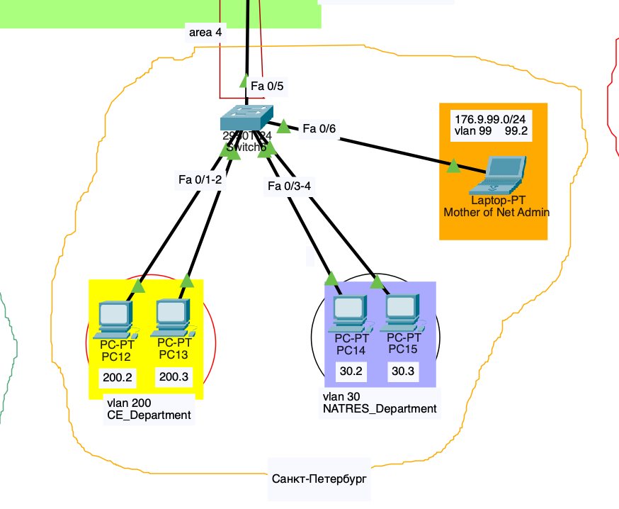

# Computer Networking Lab Project

In this project I configured a given topology

The topology consists of several parts:

## University and its Departments
- Different departments are concidered VLANs. then the connectivity between the VLANs is ensured
- RIP protocol used between the routers

## Japan
- Devices are usnig wireless communication
- RIP is used between the routers

## Russia
- Just like university departments, connected VLANs

## America
- HSRP protocol is used for the gateway routers
- EIGRP protocol is used between the routers

